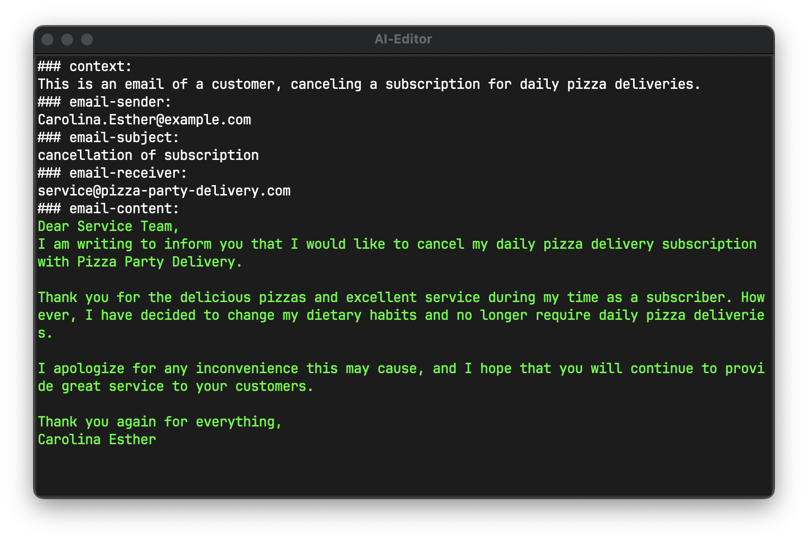

# LLM-Functions

## List of Commands
- `MODEL <model-label>` Specifying the model to use
- `LABEL <function-label>` Giving the function a name
- `VERSION <version-id>` Specifying the version of ai-functions
- `DESCR <description>` Describing what this function does
- `PARAM <name>` Parameters for using in prompt
- `PARAM <name> DESCR <description>` Parameters for using in prompt with description
- `REQUIRED PARAM <name>` Required Parameter
- `REQUIRED PARAM <name> DESCR <description>` Required Parameter with description
- `WRITE <string>` Write string to prompt
- `IF <condition> WRITE <string>` Write CMD with condition
- `TEMP <temperature>`  Specifying temperature of model
- `STOP <sequence>` Defining a stop sequence
- `IF <condition> REGEN` regenerate while condition true

## Example
Here is a simple example of an LLM-Function for writing emails:
```RUBY
VERSION 1
LABEL "email-writer"
DESCR "LLM-Function for writing emails from a given subject"
REQUIRED PARAM "subject" DESCR "The subject of the email"
REQUIRED PARAM "receiver" DESCR "The receiver of the email"
PARAM "context" DESCR "Context for the LLM how to write the email"

IF context WRITE "### context:\n{{context}}\n"
WRITE "### email-subject:\n{{subject}}\n"
WRITE "### email-receiver:\n{{receiver}}\n"
WRITE "### email-content:\n"

STOP "###"
```

Here is an example of a generated prompt for an llm from a llm-function, and what it would generate:

> Note that Carolina Esther is not a real person nor is referring to a real person.